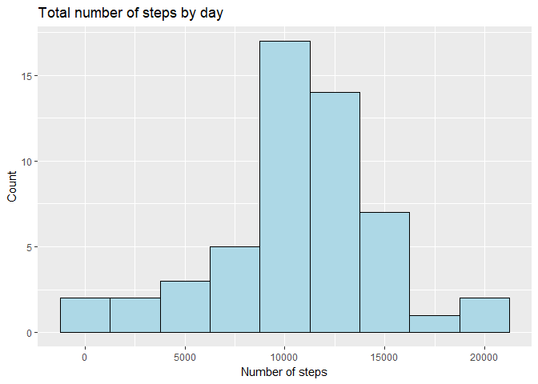
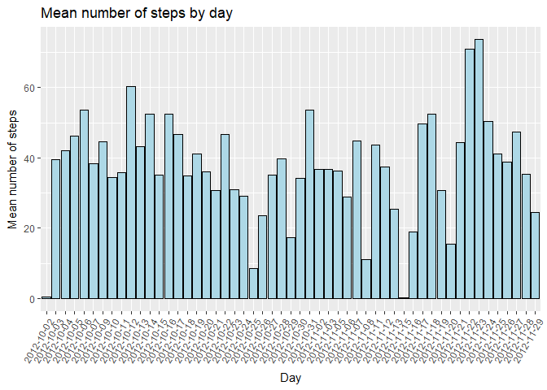
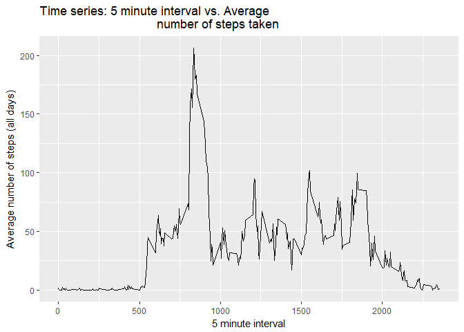
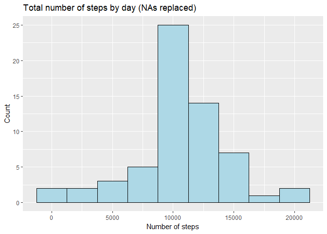
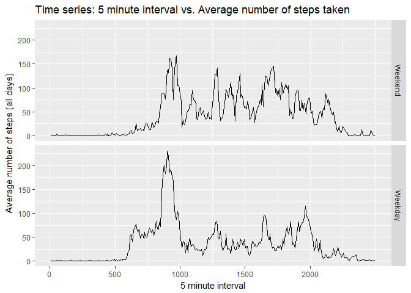

## My first R Markdown report: a new glance of reproducible research

This is a report of a exploratory analysis from a dataset of activity monitoring data, recorded from devices such as Fitbit or Nike Fuelband.   

For each observation, the dataset contains three (3) variables:  

* steps: Number of steps in a 5-minute interval.  
* date: The date on which the measurement was taken.  
* interval: an identifier for the 5-minute interval in which the measurement was taken.  


### Loading the dataset

The dataset was downloaded in a csv format and loaded into R with the ```readr()``` package
in order to obtain a tibble to work on with *tydiverse* packages. Dates columns were formated as such.


```r
library(readr)
activity <- read_csv("activity.csv", col_types = cols(date = col_date(format = "%Y-%m-%d"), 
                                                      steps = col_double()), na = "NA") # Read data file.
```

### Mean total number of steps per day (*First task*)

In order to evaluate the mean number of steps per day, some transformations were necesary in the dataset. Rows with ```NA``` were eliminated for this analysis and the dates were treated as a ```factor()``` in order to compute the sum of steps taken each day. 


```r
library(dplyr)
```

```r
activity_wo_na <- na.omit(activity) # Eliminate rows with NAs

activity_wo_na$interval <- as.factor(activity_wo_na$interval) # Transform interval in a Factor variable

activity_w_dates <- mutate(activity_wo_na, date_factor = as.factor(date)) %>%
                        group_by(date_factor) # Create a new date factor and group the data by this factor

head(activity_w_dates)
```

```
## # A tibble: 6 x 4
## # Groups:   date_factor [1]
##   steps       date interval date_factor
##   <dbl>     <date>   <fctr>      <fctr>
## 1     0 2012-10-02        0  2012-10-02
## 2     0 2012-10-02        5  2012-10-02
## 3     0 2012-10-02       10  2012-10-02
## 4     0 2012-10-02       15  2012-10-02
## 5     0 2012-10-02       20  2012-10-02
## 6     0 2012-10-02       25  2012-10-02
```

The ```sumarise()``` function was used to obtain the total steps per day (with the ```sum()``` function), the mean and the median steps per day. The ```date_factor``` variable was a used as a grouping variable.


```r
steps_by_day <- summarise(activity_w_dates, step_number = sum(steps),
                          steps_mean = mean(steps), steps_median = median(steps))
print(steps_by_day)
```

```
## # A tibble: 53 x 4
##    date_factor step_number steps_mean steps_median
##         <fctr>       <dbl>      <dbl>        <dbl>
##  1  2012-10-02         126    0.43750            0
##  2  2012-10-03       11352   39.41667            0
##  3  2012-10-04       12116   42.06944            0
##  4  2012-10-05       13294   46.15972            0
##  5  2012-10-06       15420   53.54167            0
##  6  2012-10-07       11015   38.24653            0
##  7  2012-10-09       12811   44.48264            0
##  8  2012-10-10        9900   34.37500            0
##  9  2012-10-11       10304   35.77778            0
## 10  2012-10-12       17382   60.35417            0
## # ... with 43 more rows
```

The results stored in this new ```tibble``` were used to generate the histogram for the total number of steps per day and the mean number of steps per day. This final result will be presented in a barplot.


```r
library(ggplot2)
hist <- ggplot(data = steps_by_day, aes(steps_by_day$step_number)) + 
        geom_histogram(binwidth = 2500, col = "black", fill = "lightblue") +
        labs(title = "Total number of steps by day", x = "Number of steps",
             y = "Count")

n.df <- data.frame(days = as.character(steps_by_day$date_factor), 
                   stepsmean = steps_by_day$steps_mean)

bars <- ggplot(data = n.df, aes(x = days, y = stepsmean)) +
        geom_bar(stat = "identity", col = "black", fill = "lightblue") + 
        theme(axis.text.x = element_text(angle=60, hjust=1)) +
        labs(title = "Mean number of steps by day", x = "Day",
        y = "Mean number of steps")
                       
print(hist)
```

<!-- -->

```r
print(bars)
```

<!-- -->

### Average daily activity pattern (*Second task*)

For this section of the analysis, the `activity_wo_na` ```tible``` (previously created) was used. To analyze the daily activity pattern, `interval` was used as grouping variable. 


```r
activity_w_intervals <- group_by(activity_wo_na, interval)

print(activity_w_intervals)
```

```
## # A tibble: 15,264 x 3
## # Groups:   interval [288]
##    steps       date interval
##    <dbl>     <date>   <fctr>
##  1     0 2012-10-02        0
##  2     0 2012-10-02        5
##  3     0 2012-10-02       10
##  4     0 2012-10-02       15
##  5     0 2012-10-02       20
##  6     0 2012-10-02       25
##  7     0 2012-10-02       30
##  8     0 2012-10-02       35
##  9     0 2012-10-02       40
## 10     0 2012-10-02       45
## # ... with 15,254 more rows
```

The average steps by interval (for all days) was calculated as follows


```r
steps_by_interval <- summarise(activity_w_intervals, Avrg.Steps = mean(steps))

print(steps_by_interval)
```

```
## # A tibble: 288 x 2
##    interval Avrg.Steps
##      <fctr>      <dbl>
##  1        0  1.7169811
##  2        5  0.3396226
##  3       10  0.1320755
##  4       15  0.1509434
##  5       20  0.0754717
##  6       25  2.0943396
##  7       30  0.5283019
##  8       35  0.8679245
##  9       40  0.0000000
## 10       45  1.4716981
## # ... with 278 more rows
```

```r
time_plot_1 <- ggplot(data = steps_by_interval, (aes(x = as.numeric(levels(interval)), 
                                                     y = Avrg.Steps))) +
               geom_line() + labs(title = "Time series: 5 minute interval vs. Average
                                  number of steps taken",
                                  x = "5 minute interval",
                                  y = "Average number of steps (all days)")
               
print(time_plot_1)
```

<!-- -->

On average, the interval `835` contains the maximum number of steps


```r
max_interval <- steps_by_interval[which.max(steps_by_interval$Avrg.Steps),]

print(max_interval)
```

```
## # A tibble: 1 x 2
##   interval Avrg.Steps
##     <fctr>      <dbl>
## 1      835   206.1698
```

### Working with missing values (`NA`). Inputing them and evaluating its effects on the data (*Third task*)

We start again loading the "main" dataset: the raw data with no transformations.


```r
activity <- read_csv("activity.csv", col_types = cols(date = col_date(format = "%Y-%m-%d"), 
                                                      steps = col_double()), na = "NA") # Read data file.
```

The number of `NA`s in the dataset were count by column, to evaluate if these missing values were present in just one or other columns


```r
NAs_per_var <- apply(X = activity, MARGIN = 2, FUN = function(X){sum(is.na(X))})

print(NAs_per_var)
```

```
##    steps     date interval 
##     2304        0        0
```

The `interval` variable was transformed `as.factor()` bo used to `left_join()` the `activity` dataset with the previously created `steps_by_interval` dataset. This final one contains the average steps by 5-minute interval. In this sense, the `NA`s in the `activity` dataset were substituted for the mean steps of the 5-minute interval representative of a particular missing value. 


```r
activity$interval <- as.factor(activity$interval)

activity_w_mean_steps <- left_join(x = activity, y = steps_by_interval, by = "interval")

head(activity_w_mean_steps)
```

```
## # A tibble: 6 x 4
##   steps       date interval Avrg.Steps
##   <dbl>     <date>   <fctr>      <dbl>
## 1    NA 2012-10-01        0  1.7169811
## 2    NA 2012-10-01        5  0.3396226
## 3    NA 2012-10-01       10  0.1320755
## 4    NA 2012-10-01       15  0.1509434
## 5    NA 2012-10-01       20  0.0754717
## 6    NA 2012-10-01       25  2.0943396
```

```r
cases <- which(is.na(activity_w_mean_steps$steps) == TRUE)

activity_w_mean_steps$steps[cases] <- activity_w_mean_steps$Avrg.Steps[cases]

data_filled_NA <- activity_w_mean_steps
head(data_filled_NA)
```

```
## # A tibble: 6 x 4
##       steps       date interval Avrg.Steps
##       <dbl>     <date>   <fctr>      <dbl>
## 1 1.7169811 2012-10-01        0  1.7169811
## 2 0.3396226 2012-10-01        5  0.3396226
## 3 0.1320755 2012-10-01       10  0.1320755
## 4 0.1509434 2012-10-01       15  0.1509434
## 5 0.0754717 2012-10-01       20  0.0754717
## 6 2.0943396 2012-10-01       25  2.0943396
```

The mean, median and total number of steps taken by day were calculated. An histogram is plotted to compare these results with the ones of the first task (where the `NA`s were omited)


```r
act_filled_NA <- mutate(data_filled_NA, date_factor = as.factor(date)) %>% group_by(date)

steps_by_day_filled <- summarise(act_filled_NA, step_number = sum(steps),
                          steps_mean = mean(steps), steps_median = median(steps))

head(steps_by_day_filled)
```

```
## # A tibble: 6 x 4
##         date step_number steps_mean steps_median
##       <date>       <dbl>      <dbl>        <dbl>
## 1 2012-10-01    10766.19   37.38260     34.11321
## 2 2012-10-02      126.00    0.43750      0.00000
## 3 2012-10-03    11352.00   39.41667      0.00000
## 4 2012-10-04    12116.00   42.06944      0.00000
## 5 2012-10-05    13294.00   46.15972      0.00000
## 6 2012-10-06    15420.00   53.54167      0.00000
```

```r
hist_2 <- ggplot(data = steps_by_day_filled, aes(steps_by_day_filled$step_number)) + 
          geom_histogram(binwidth = 2500, col = "black", fill = "lightblue") +
          labs(title = "Total number of steps by day (NAs replaced)", x = "Number of steps",
          y = "Count")

print(hist_2)
```

<!-- -->

```r
print(hist)
```

<!-- -->

When comparing the histograms, it could be noticed that **the count is increased while filling the `NA`s with new data**, as expected because now there is no omited rows. Nevertheless, **the behavior of the variable is still very similar**, because the mean values that filled the `NA`s are representatives of the tendency of the values taken by the `steps` variable for each 5-minute interval. 

### Evaluating differences between activity patterns between weekdays and weekends (*Fourth task*)

A new factor variable `is.weekday` was created to differenciate between weekends and weekdays in the dataset with the final objective of making comparissons between these conditions


```r
data_filled_NA
```

```
## # A tibble: 17,568 x 4
##        steps       date interval Avrg.Steps
##        <dbl>     <date>   <fctr>      <dbl>
##  1 1.7169811 2012-10-01        0  1.7169811
##  2 0.3396226 2012-10-01        5  0.3396226
##  3 0.1320755 2012-10-01       10  0.1320755
##  4 0.1509434 2012-10-01       15  0.1509434
##  5 0.0754717 2012-10-01       20  0.0754717
##  6 2.0943396 2012-10-01       25  2.0943396
##  7 0.5283019 2012-10-01       30  0.5283019
##  8 0.8679245 2012-10-01       35  0.8679245
##  9 0.0000000 2012-10-01       40  0.0000000
## 10 1.4716981 2012-10-01       45  1.4716981
## # ... with 17,558 more rows
```

```r
w_days <- mutate(data_filled_NA, day = weekdays(date)) %>%
          mutate(is.weekday = factor((day %in% c("lunes", "martes","miércoles","jueves","viernes")), levels = c(FALSE,TRUE), 
                                      labels = c("Weekend", "Weekday")))

w_days_g <- group_by(w_days, interval, is.weekday)

head(w_days_g)
```

```
## # A tibble: 6 x 6
## # Groups:   interval, is.weekday [6]
##       steps       date interval Avrg.Steps   day is.weekday
##       <dbl>     <date>   <fctr>      <dbl> <chr>     <fctr>
## 1 1.7169811 2012-10-01        0  1.7169811 lunes    Weekday
## 2 0.3396226 2012-10-01        5  0.3396226 lunes    Weekday
## 3 0.1320755 2012-10-01       10  0.1320755 lunes    Weekday
## 4 0.1509434 2012-10-01       15  0.1509434 lunes    Weekday
## 5 0.0754717 2012-10-01       20  0.0754717 lunes    Weekday
## 6 2.0943396 2012-10-01       25  2.0943396 lunes    Weekday
```

```r
w_days_sg <- summarise(w_days_g, Avrg.Steps = mean(steps))

time_plot_final <- ggplot(data = w_days_sg, (aes(x = as.numeric(interval), y = Avrg.Steps))) +
                   geom_line() + labs(title = "Time series: 5 minute interval vs. Average number of steps taken",
                                  x = "5 minute interval",
                                  y = "Average number of steps (all days)") + 
                   facet_grid(is.weekday ~.) + 
                   scale_x_continuous(breaks = c(0,57.6,115.2,172.8,230.4), 
                                      labels = c("0","500","1000","1500","2000"))
                   
print(time_plot_final)
```

<!-- -->
